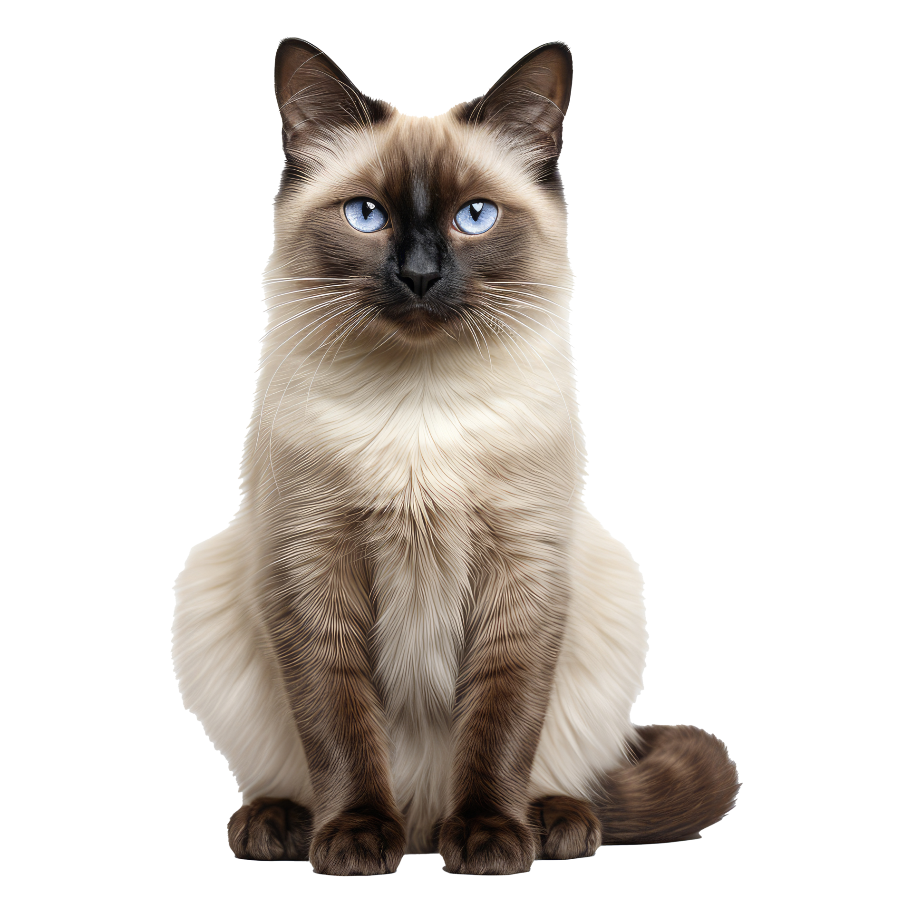
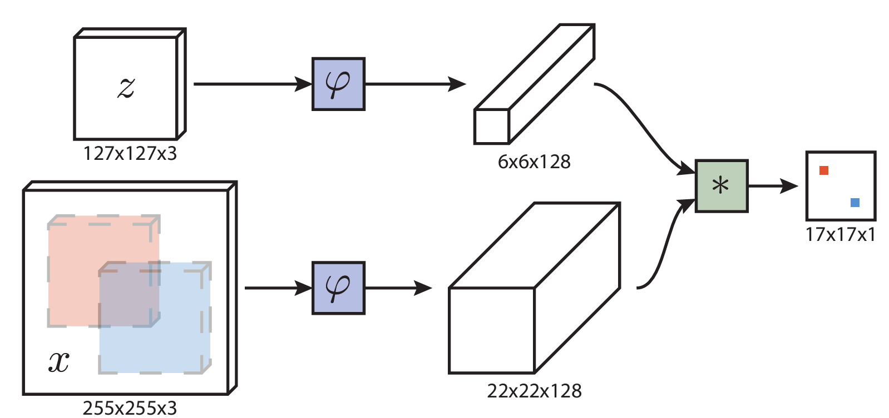
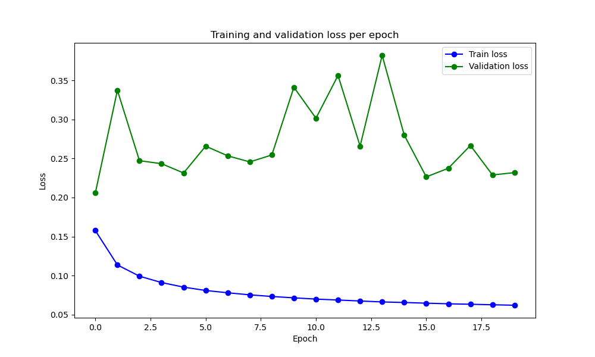
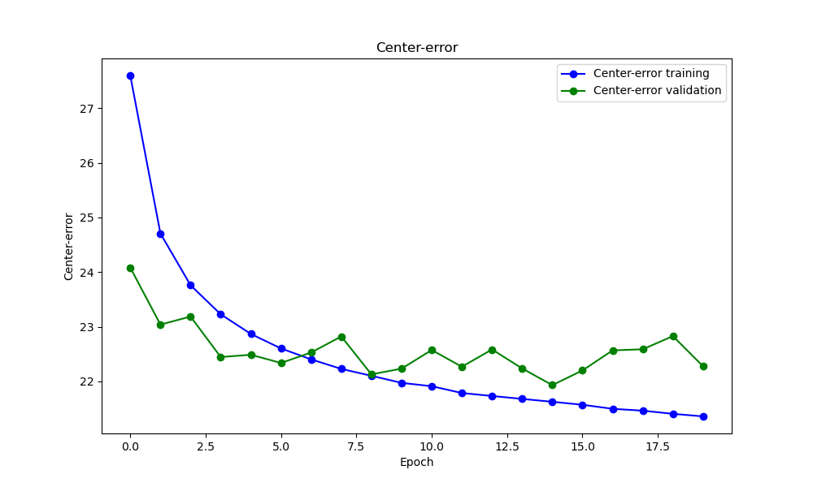
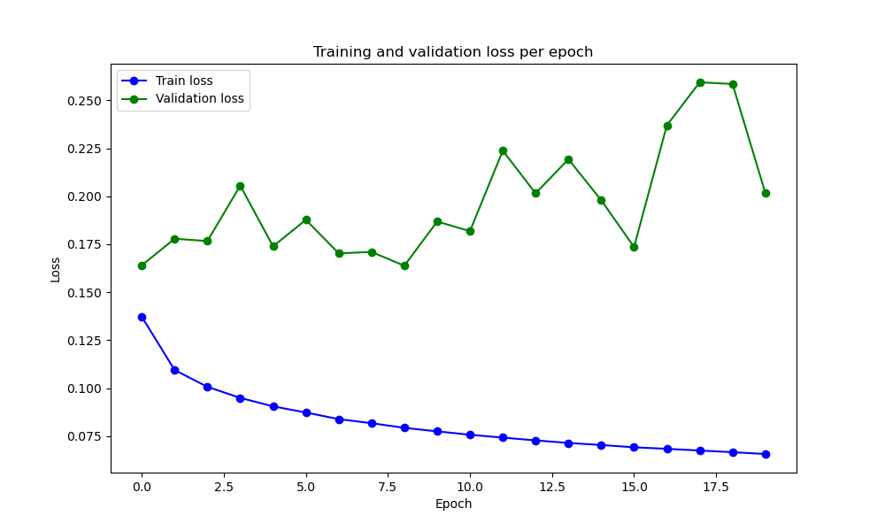
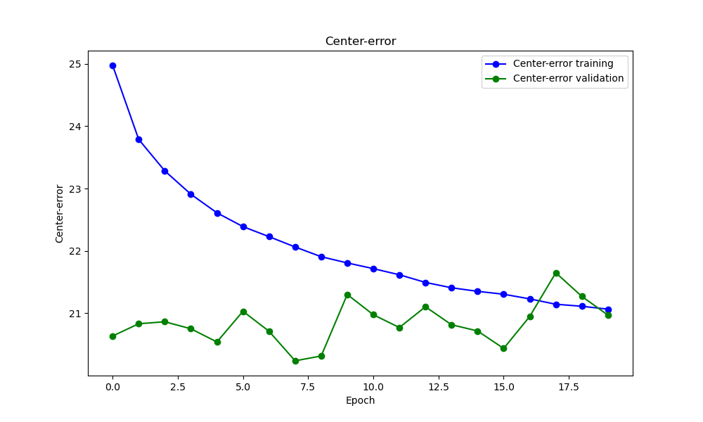
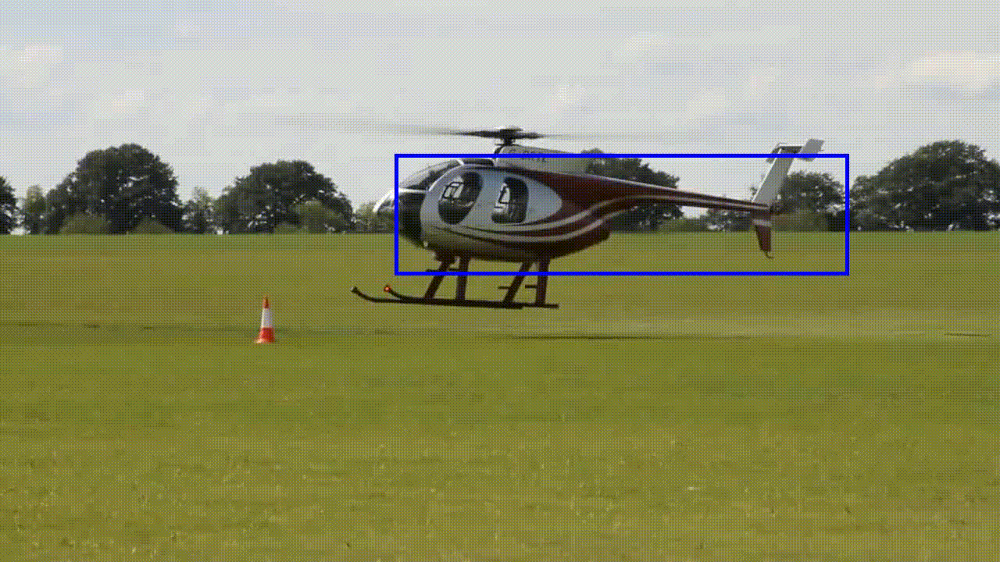

<!-- PROJECT LOGO -->
 

  
  <h3 align="center">Object tracking with Siamese networks</h3>

<!-- TABLE OF CONTENTS -->

  
Table of contents

  <ol>
    <li><a href="#introduction">Introduction</a></li>
    <li><a href="#siamese-networks">Siamese Networks</a></li>
    <li><a href="#project-structure">Project Structure</a></li>
    <li><a href="#model-architecture">Model architecture</a></li>
    <li><a href="#results">Results</a></li>
    <li><a href="#challenges-and-future-work">Challenges and Future Work</a></li>
    <li><a href="#references">References</a></li>
    <li><a href="#authors">Authors</a></li>
    <li><a href="#acknowledgements">Acknowledgements</a></li>
  </ol>

<!-- Introduction -->
##  Introduction 

This project was developed as part of the Practical Seminar in Machine Learning (PSI:ML) 10. It implements single object tracking using Siamese networks, focusing on the challenge of accurately tracking a specified target throughout a video. The target is identified in the first frame and must be consistently detected and followed in all subsequent frames.

<!-- Project Structure -->
##  Project Structure 
Project structure is as follows:
<ul>
  <li>data - LaSOT images (in our case only bicycle and airplane classes of images)</li>
  <li>training - with all .py files that are already in it</li>
</ul>
Download LaSOT dataset from <a href="https://onedrive.live.com/?authkey=%21AKDCa351cL3g44Q&id=83EEFE32EECC7F4B%2133234&cid=83EEFE32EECC7F4B">LaSOT</a>. In the code training and test set are seperated via different classes ImageLASOT_train, ImageLASOT_val, ImageLASOT_test. The main difference between these classes is in the value of the attribute <i>subclasses_indexes</i>. Each class of images has 20 subclasses, and you can play around with this to determine how much parameters are going to be for training, validation and test sets.

<!-- Siamese Networks -->
##  Siamese Networks
Siamese networks are convolutional networks trained on images. They are used to determine the measure of similarity between images, and based on this principle, they can be set up to track an object across frames in a video. There is a smaller image – the target, and a larger image – the sample, in which the target is searched. The target and the sample are chosen to be either similar or dissimilar. For pairs of dissimilar images, the goal is for the result to be a search map with the lowest possible probability, while for similar ones, it should be as high as possible. The next position of the target is identified based on the previous one and the pixels surrounding an area slightly wider than the bounding box where the target was found in the previous frame. The pixel from the search map with the highest score is taken as the center of the target in the next frame.
 

  

<!-- Model arch -->
##  Model architecture 
The model is built around a simple convolutional neural network (CNN), implemented using PyTorch. Both the target frame and the search image are passed through the same (hence the name, Siamese network) CNN to extract embeddings of size 33x33 for each image. These embeddings represent the most important features of the images and are then used to compute the similarity between them. 
 We chose to start with the pre-trained model provided in the reference and then fine-tune it on our own dataset. The network used for the pre-trained model is defined in the **models.py** file.
Since the training was done on a pre-trained network, which was initially trained on a different dataset, the first step was to verify whether a single image from the new dataset would overfit on the pre-existing model, and we successfully achieved this.
<!-- Project Structure -->
##  Results 

The loss is calculated using Binary Cross-Entropy Loss with logits between a predicted score map and ground truth labels, where each pixel is classified as positive or negative. The loss is weighted by a second label map that indicates whether each pixel is neutral (ignored) or should contribute to the loss calculation.  For evaluation, the model uses center error metrics. It calculates the displacement between the estimated center of a target in the network's output and the expected center (ground-truth) in the search image, measured in pixels. It identifies the maximum response in the network's output, computes the distance from the center of the image, and scales this error by an upscale_factor to account for the difference in feature map and input image sizes.  
The same loss function and metrics were used in the implementation provided in the references.

  
  

  
  

In our work, we have experimented with two different optimizers for training, Adam and SGD. The top two graphs display the results using the Adam optimizer, while the bottom two represent the Stochastic Gradient Descent (SGD) optimizer. For both optimizers, the training loss (blue line) consistently decreases over the epochs, indicating effective learning progress. However, the validation loss (green line) shows noticeable fluctuations, suggesting instability and potential overfitting in both cases. Similarly, the center error for both optimizers shows a steady reduction in training center error, but the validation results remain inconsistent. Although data augmentation was applied to mitigate overfitting, it did not prove particularly effective in this case.
 Below is the visualization of object tracking generated by our model, using frames from our dataset.  

<!-- Project Structure -->
##  Challenges and future work 

In this section you should provide instructions on how to use this repository to recreate your project locally.

<!-- Project Structure -->
##  References 

Our work was based on the <a href="https://arxiv.org/pdf/1606.09549">Fully-Convolutional Siamese Networks for Object Tracking</a>. The model, losses, optimizers, and metrics were adopted from the project <a href = "https://github.com/rafellerc/Pytorch-SiamFC">Pytorch-SiamFC</a>.

<!-- Authors -->
## Authors

<ul>
  <li>
    <a href="https://github.com/0elena0">Elena Nešović </a>
  </li>
  <li>
    <a href="https://github.com/Dovlane">Vladimir Ignjatijević</a>
  </li>
</ul>

<!-- ACKNOWLEDGEMENTS -->
## Acknowledgements

It was an honor to be part of the PSIML 10 seminar! We are especially grateful for the help of our mentors:
<ul>
  <li><a href="https://www.linkedin.com/in/vukasinrankovic/">Vukašin Ranković</a></li>
  <li><a href="https://www.linkedin.com/in/stefan-stepanovic/">Stefan Stepanović</a></li>
  <li><a href="https://www.linkedin.com/in/stefan-mojsilovic/">Stefan Mojsilović</a></li>
</ul>
and the significant contributor <a href="https://www.linkedin.com/in/urosstegic/">Uroš Stegić</a>.

